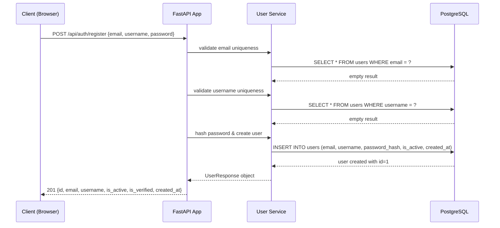
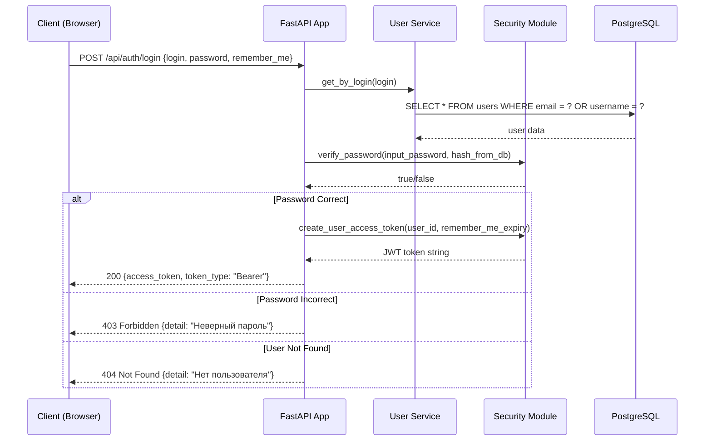
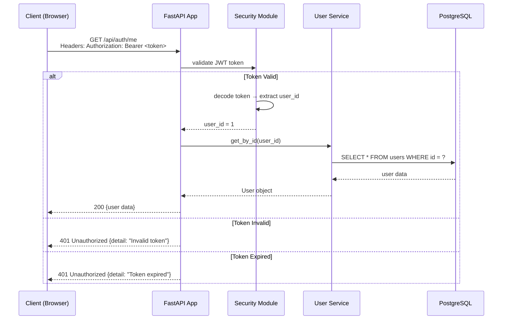
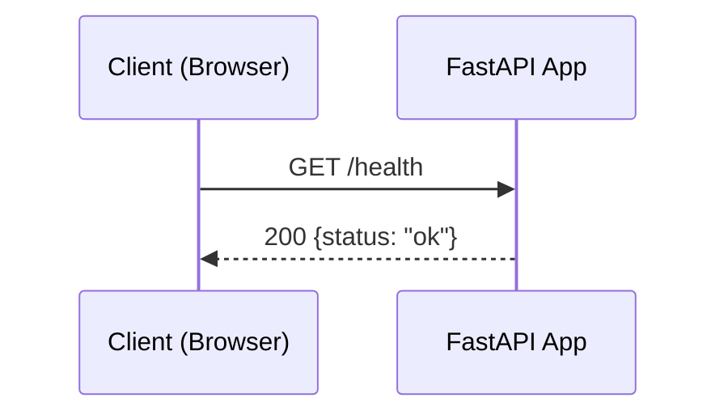
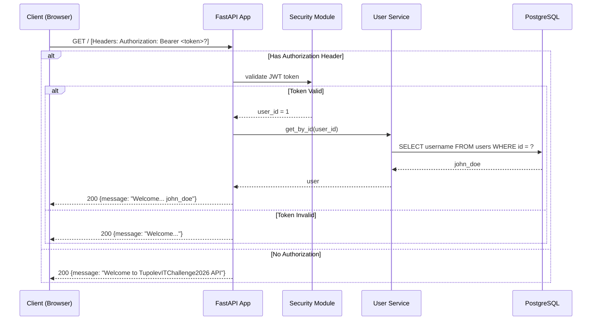
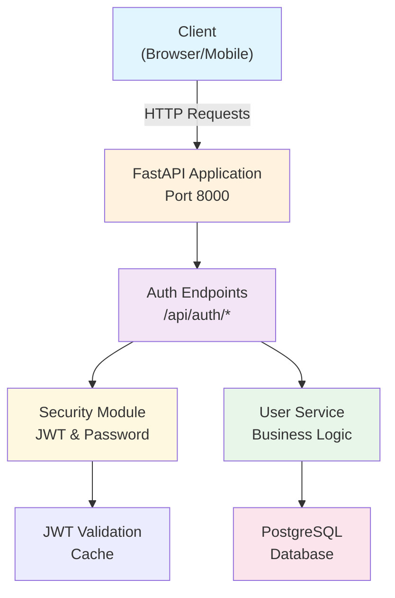

## 📚 Полная документация API

### 1. Регистрация пользователя

**Endpoint:** `POST /api/auth/register`

**Описание:** Создание нового аккаунта в системе.

**Request Body:**
```json
{
  "email": "user@example.com",
  "username": "john_doe",
  "password": "SecurePassword123!"
}
```

**Response (201 Created):**
```json
{
  "id": 1,
  "email": "user@example.com",
  "username": "john_doe",
  "is_active": true,
  "is_verified": false,
  "created_at": "2026-02-19T10:30:00Z",
  "updated_at": null
}
```

**Состояние взаимодействия:**



**Возможные ошибки:**
- `400 Bad Request` — Email уже зарегистрирован
- `400 Bad Request` — Username уже существует
- `400 Bad Request` — Пароль менее 8 символов

---

### 2. Вход в систему (Login)

**Endpoint:** `POST /api/auth/login`

**Описание:** Аутентификация пользователя и получение JWT токена.

**Request Body:**
```json
{
  "login": "user@example.com",
  "password": "SecurePassword123!",
  "remember_me": true
}
```

**Response (200 OK):**
```json
{
  "access_token": "eyJhbGciOiJIUzI1NiIsInR5cCI6IkpXVCJ9...",
  "token_type": "Bearer"
}
```

**Состояние взаимодействия:**



**Возможные ошибки:**
- `404 Not Found` — Пользователь не найден
- `403 Forbidden` — Неверный пароль

---

### 3. Получение профиля (Get Current User)

**Endpoint:** `GET /api/auth/me`

**Описание:** Получение информации о текущем авторизованном пользователе.

**Headers:**
```
Authorization: Bearer <ACCESS_TOKEN>
```

**Response (200 OK):**
```json
{
  "id": 1,
  "email": "user@example.com",
  "username": "john_doe",
  "is_active": true,
  "is_verified": false,
  "created_at": "2026-02-19T10:30:00Z",
  "updated_at": "2026-02-19T11:00:00Z"
}
```

**Состояние взаимодействия:**



**Возможные ошибки:**
- `401 Unauthorized` — Токен неверный или истек
- `401 Unauthorized` — Токен отсутствует в заголовках

---

### 4. Здоровье сервера (Health Check)

**Endpoint:** `GET /health`

**Описание:** Проверка работоспособности API сервера.

**Response (200 OK):**
```json
{
  "status": "ok"
}
```

**Состояние взаимодействия:**



---

### 5. Главная страница (Root)

**Endpoint:** `GET /`

**Описание:** Главная страница API, показывает приветственное сообщение.

**Headers (опционально):**
```
Authorization: Bearer <ACCESS_TOKEN>
```

**Response (200 OK) - без авторизации:**
```json
{
  "message": "Welcome to TupolevITChallenge2026 API"
}
```

**Response (200 OK) - с авторизацией:**
```json
{
  "message": "Welcome to TupolevITChallenge2026 API, john_doe"
}
```

**Состояние взаимодействия:**



---

### Архитектура системы


